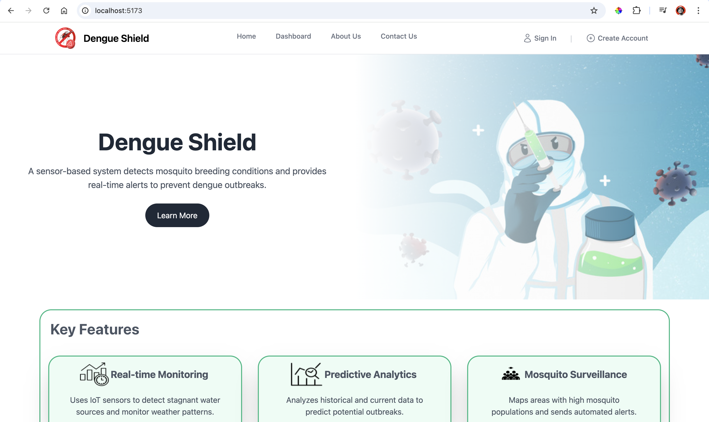

# Navbar with Authentication and Conditional Rendering

This project implements a responsive navigation bar using **React** and **Tailwind CSS**, with conditional rendering based on user authentication status.

## 🚀 Features

- **Responsive Navbar:** Adapts seamlessly across devices.
- **Authentication Links:** Displays 'Sign In' and 'Create Account' links for unauthenticated users.
- **User Profile & Notifications:** Shows user avatar and a bell icon when logged in.
- **Dynamic Rendering:** Navbar updates dynamically based on authentication status.
- **Icons Integration:** Used Heroicons for better visuals.

## 📚 Technologies Used

- **React.js**
- **Tailwind CSS**
- **Heroicons**
- **React Router** (for navigation)

## 📂 Project Structure

```plaintext
src/
├── components/
│   ├── Navbar.jsx  // Main Navbar component
│   └── Sidebar.jsx // Mobile sidebar menu
├── assets/
│   ├── images/     // Logo and other assets
├── pages/
│   ├── SignIn.jsx  // Sign-in page
│   ├── CreateAccount.jsx  // Account creation page
│   ├── Dashboard.jsx // Dashboard page
│   └── Profile.jsx   // User profile page
└── App.jsx          // Main application entry point
```

## 🛠️ Installation

1. Clone the repository:
   ```bash
   git clone https://github.com/your-username/project-name.git
   ```
2. Navigate to the project folder:
   ```bash
   cd project-name
   ```
3. Install dependencies:
   ```bash
   npm install
   ```
4. Start the development server:
   ```bash
   npm run dev
   ```

## 🧠 Usage

- Open `http://localhost:3000` in your browser.
- **Sign In/Create Account:** Access authentication options.
- **After Login:** Bell icon and user avatar will replace authentication links.

## 🔑 Environment Variables

Make sure to set the following environment variables in a `.env` file:
```
REACT_APP_API_URL=<your_api_url>
```

## 📸 Screenshots

- **Default Navbar (Unauthenticated)**
  
- **Authenticated Navbar**
  

## 🤝 Contribution

Contributions are welcome! Feel free to open an issue or submit a pull request.


## 📬 Contact

- **Your Name:** [Your Email](mailto:thanujapriyadarshane26@gmail.com)
- **LinkedIn:** [Your LinkedIn Profile]([https://linkedin.com/in/yourprofile](https://www.linkedin.com/in/thanuja-priyadarshane/))
- **GitHub:** [Your GitHub Profile](https://github.com/thanujaDev26)

---

_Star this project if you found it helpful! ⭐️_
